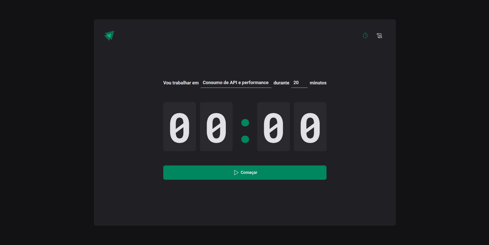

<p align="center">
  
   
  
</p>

<p align="center">
  <a href="#dart-sobre">Sobre</a> &#xa0; | &#xa0;
  <a href="#rocket-tecnologias">Tecnologias</a> &#xa0; | &#xa0;
  <a href="#warning-pré-requisitos"> Pré requisitos</a> &#xa0; | &#xa0;
  <a href="#checkered_flag-começando">Começando</a> &#xa0; | &#xa0;
  <a href="#memo-licença">Licença</a> &#xa0; | &#xa0;
  <a href="https://github.com/geovaneborba" target="_blank">Autor</a>
</p>

<br>

## :dart: Sobre

<p>
O Ignite Timer foi um projeto construído durante o módulo: Criando SPAs com React, que faz parte do programa de especialização Ignite da <a href='https://www.rocketseat.com.br/' target="_blank">Rocketseat</a>.
Neste projeto foi trabalhado conceitos importantes do react como por exemplo:

- Estados
- Imutabilidade do estado
- Listas e chaves no ReactJS
- Propriedades
- Componentização
- Context API do React
</p>

Além dos conceitos do React, foi trabalhado também com a utilização de rotas na aplicação utilizando a lib do [React Router Dom](https://reactrouter.com/en/main), com Formulários utilizando a lib do [React Hook Forms](https://react-hook-form.com/), validação de formulários utilizando o [Zod](https://zod.dev/), criação de componentes estilizados com [Styled Components](https://styled-components.com/) e manipulação de datas com a lib do [date-fns](https://date-fns.org/)

<p align="right">(<a href="#top">Voltar para o topo</a>)</p>

## :rocket: Tecnologias

As seguintes tecnologias foram usadas na construção do projeto:

- [Vite](https://vitejs.dev/)
- [React](https://reactjs.org/docs/getting-started.html)
- [TypeScript](https://www.typescriptlang.org/)
- [ESLint](https://eslint.org/)
- [Prettier](https://prettier.io/)
- [Styled Components](https://styled-components.com/)
- [React Router Dom](https://reactrouter.com/en/main),
- [React Hook Forms](https://react-hook-form.com/)
- [zod](https://zod.dev/)
- [date-fns](https://date-fns.org/)

<p align="right">(<a href="#top">Voltar para o topo</a>)</p>

## :warning: Pré-requisitos

Antes de começar, você precisa ter o [Git](https://git-scm.com) e o [Node](https://nodejs.org/en/) instalados em sua maquina.

<p align="right">(<a href="#top">Voltar para o topo</a>)</p>

## :checkered_flag: Começando

```bash
# Clone este repositório
$ git clone https://github.com/geovaneborba/rocketseat-ignite-timer.git

# Entre na pasta
$ cd rocketseat-ignite-timer

# Instale as dependências
$ npm install

# Para iniciar o projeto
$ npm run dev
# O app vai inicializar e será informado no terminal o endereço e porta onde estará rodando a aplicação
# geralmente é http://localhost:5173/
```

<p align="right">(<a href="#top">Voltar para o topo</a>)</p>

## :memo: Licença

Este projeto está sob licença MIT. Veja o arquivo [LICENSE](LICENSE.md) para mais detalhes.

<p align="right">(<a href="#top">Voltar para o topo</a>)</p>

<p align="center">Feito com ❤️ por <a href="https://github.com/geovaneborba" target="_blank">Geovane Borba</a></p>
